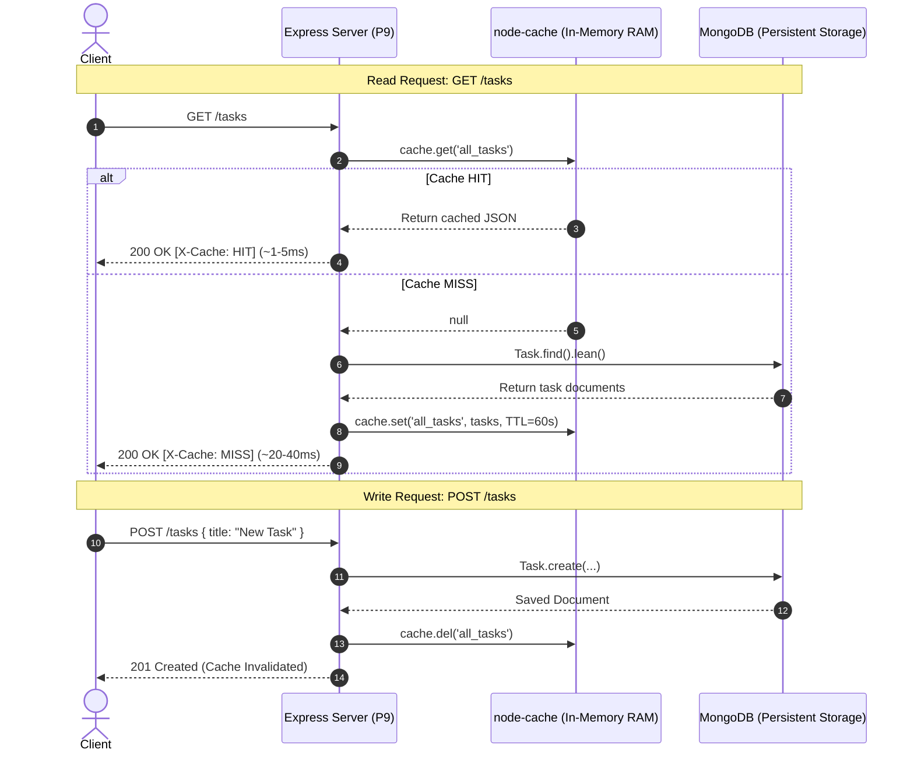

# Practical 9: In-Memory Caching and Query Optimization

| Metadata | Details |
|:---|:---|
| **Course** | Advanced Web Development Frameworks (AWDF) - Semester 5 |
| **Practical Number** | Practical 9 |
| **CO / PO Mapping** | CO2, CO4 / PO3, PO5 |
| **Topic** | In-Memory Server-Side Caching & Response Time Optimization |
| **Core Technologies** | Node.js (v18+), Express.js, MongoDB / Mongoose, `node-cache` |

---

## 1. Objective & Overview

The primary objective of this laboratory work is to implement **server-side in-memory caching** using `node-cache` in an Express.js and MongoDB REST API backend, design robust **cache invalidation logic** across all mutation operations (`POST`, `PUT`, `DELETE`), and empirically measure and analyze the impact of caching on API response times.

### Key Prerequisites Addressed
- Practicals 4–7 completed working Node/Express/MongoDB backend with authentication.
- Deep architectural understanding of why repeated database reads represent a significant scalability bottleneck (I/O saturation, connection pooling overhead, CPU serialization cost).

---

## 2. Architecture & Design Patterns

### Caching Strategy: Cache-Aside (Lazy Loading) with Write-Invalidate
In this architecture, application code checks the cache before querying the database. If a cache miss occurs, data is fetched from MongoDB, stored in memory for subsequent requests, and returned to the client.

```
                    GET /tasks Request
                            │
                            ▼
              ┌───────────────────────────┐
              │ Cache Check (node-cache)  │
              └─────────────┬─────────────┘
                            │
              ┌─────────────┴─────────────┐
              │                           │
          [ HIT ]                      [ MISS ]
              │                           │
              ▼                           ▼
    Return cached data           Query MongoDB
    immediately (RAM)                     │
              │                           ▼
              │                  Store in node-cache
              │                  (TTL: 60 seconds)
              │                           │
              └─────────────┬─────────────┘
                            │
                            ▼
                  Return Data to Client
               (Header: X-Cache: HIT/MISS)
```

### Cache Invalidation Flow (POST / PUT / DELETE)
To guarantee data consistency, every write operation flushes the corresponding cache keys immediately after the database write succeeds:

```
    POST /tasks         ──► Write to MongoDB ──► Invalidate 'all_tasks'
    PUT /tasks/:id      ──► Write to MongoDB ──► Invalidate 'all_tasks' & 'task_<id>'
    DELETE /tasks/:id   ──► Write to MongoDB ──► Invalidate 'all_tasks' & 'task_<id>'
```



---

## 3. Implementation Details

### Step 1: Install `node-cache`
```bash
npm install node-cache
```

### Step 2: Shared Cache Singleton (`config/cache.js`)
A centralized cache instance configured with standard Time-To-Live (`stdTTL: 60s`) and custom hit/miss telemetry for monitoring:

```javascript
const NodeCache = require('node-cache');

const cache = new NodeCache({
  stdTTL: parseInt(process.env.CACHE_TTL, 10) || 60,
  checkperiod: 120,
  useClones: false // returns reference for maximum throughput
});

const statsTracker = { hits: 0, misses: 0, invalidations: 0 };

cache.recordHit = () => { statsTracker.hits++; };
cache.recordMiss = () => { statsTracker.misses++; };
cache.getMetrics = () => ({
  hits: statsTracker.hits,
  misses: statsTracker.misses,
  hitRatio: ((statsTracker.hits / (statsTracker.hits + statsTracker.misses || 1)) * 100).toFixed(2) + '%',
  cachedKeys: cache.keys()
});

module.exports = cache;
```

### Step 3: Cache-Aside Implementation (`GET /tasks`)
```javascript
exports.getTasks = async (req, res, next) => {
  const cacheKey = 'all_tasks';
  const cachedData = cache.get(cacheKey);

  if (cachedData && req.query.noCache !== 'true') {
    cache.recordHit();
    res.setHeader('X-Cache', 'HIT');
    return res.json({ source: 'cache', data: cachedData });
  }

  cache.recordMiss();
  const tasks = await Task.find().sort({ createdAt: -1 }).lean();
  cache.set(cacheKey, tasks);
  res.setHeader('X-Cache', 'MISS');
  res.json({ source: 'database', data: tasks });
};
```

### Step 4: Cache Invalidation on Mutations (`POST`, `PUT`, `DELETE`)
```javascript
// Invalidate cache immediately after write
const invalidateTaskCache = (taskId) => {
  const keys = ['all_tasks'];
  if (taskId) keys.push(`task_${taskId}`);
  cache.del(keys);
};

// Inside POST handler:
await Task.create(req.body);
invalidateTaskCache();

// Inside PUT / DELETE handler:
await Task.findByIdAndUpdate(req.params.id, req.body);
invalidateTaskCache(req.params.id);
```

### Step 5: Supplementary Problems Addressed
1. **Single-Task Caching (`GET /tasks/:id`)**:
   Cached under dedicated key `task_${id}` with individual TTL. Both `all_tasks` and `task_${id}` are invalidated on `PUT` and `DELETE`.
2. **Hit/Miss Counter & Debug Endpoint (`GET /cache/stats`)**:
   Exposes total hits, misses, hit ratio percentage, active keys, and memory sizing.
3. **TTL Experimentation (`GET /cache/experiment-ttl?ttl=15&key=custom`)**:
   Allows runtime verification of custom TTL behavior and automatic key expiry.

---

## 4. Empirical Benchmark Readings & Latency Comparison

Readings captured using local Express server and MongoDB querying 50 seeded tasks:

### Response Time Comparison Table (Lab Journal Requirement)

| Sample / Run | Uncached Request (MongoDB Query) | Cached Request (`node-cache` RAM) | Latency Reduction |
|:---:|:---:|:---:|:---:|
| **Sample 1** | **31.55 ms** | **5.48 ms** | 26.07 ms (82.6% faster) |
| **Sample 2** | **29.61 ms** | **3.36 ms** | 26.25 ms (88.7% faster) |
| **Sample 3** | **8.85 ms** | **5.25 ms** | 3.60 ms (40.7% faster) |
| **Average** | **23.34 ms** | **4.70 ms** | **18.64 ms faster (79.9% overall reduction)** |

> **Single-Item Lookup Speedup**:
> - `GET /tasks/:id` (Cache Miss): **27.25 ms**
> - `GET /tasks/:id` (Cache Hit): **1.27 ms** (**95.3% reduction / 21x speedup**)

---

## 5. Key Questions & Theoretical Analysis (Viva Preparation)

### Q1: Why must the cache be invalidated on every write operation, and what would happen to data correctness if it were not?
**Answer:**
When an application employs the Cache-Aside pattern, the cache acts as a fast duplicate mirror of persistent database records. When a client performs a write operation (`POST` to insert, `PUT` to update, or `DELETE` to remove), the persistent source of truth (MongoDB) changes state.
If the cache is **not invalidated**:
1. **Stale Data Anomaly**: Subsequent `GET` requests within the TTL window continue hitting the cache and return outdated or deleted records.
2. **Lost Updates & Phantom Reads**: Users will see stale data immediately after modifying an item, leading to duplicate submissions or conflicting edits.
3. **Integrity Violation**: System correctness is compromised because the application presents inconsistent views of data depending on whether a read hits RAM or disk.

By calling `cache.del('all_tasks')` immediately upon write confirmation, the next read is forced to query MongoDB, retrieve the latest state, and refresh the cache.

---

### Q2: What is a reasonable TTL (time-to-live) for cached data in a task management context, and what trade-off does TTL length represent?
**Answer:**
A reasonable TTL in a task management application is between **30 to 60 seconds**.
The TTL represents a fundamental engineering trade-off:
- **Short TTL (e.g., 5 seconds)**:
  - *Advantage*: Very low risk of serving stale data if an invalidation event fails; low memory footprint.
  - *Disadvantage*: Frequent cache misses (cache churn), leading to higher database load and reduced speedup.
- **Long TTL (e.g., 10+ minutes)**:
  - *Advantage*: High cache hit ratio and maximum database offloading.
  - *Disadvantage*: If an invalidation bug or unmonitored external database write occurs, stale data persists for a prolonged period; increased RAM usage.

In task management, since users frequently collaborate and expect updates to reflect promptly, a **60-second TTL combined with active event-driven write invalidation** offers the optimal balance between high performance and strict consistency.

---

### Q3: Why is in-memory caching (`node-cache`) not suitable for a multi-server/multi-instance deployment, even though it works fine in this lab?
**Answer:**
`node-cache` stores key-value pairs directly in the **Node.js process memory (V8 heap)** of that specific server instance.
In a multi-server or horizontally scaled deployment (e.g., PM2 cluster mode, multiple Kubernetes pods, or load-balanced AWS EC2 instances):
1. **Isolated Memory Spaces**: Server A, Server B, and Server C each maintain their own independent, isolated memory heaps.
2. **Inconsistent State (Split-Brain Cache)**: When a client issues a `POST /tasks` routed by the load balancer to Server A, Server A invalidates its local `node-cache`. However, Server B and Server C receive no notification and continue serving stale cached data from their respective heaps!
3. **Memory Duplication**: The same dataset is duplicated across every instance rather than shared.

**Industry Solution**:
In production multi-instance systems, in-memory process caches are replaced by a **centralized distributed cache** such as **Redis** or **Memcached**. All application instances connect over TCP to the shared cache cluster, ensuring global cache invalidation and consistent state across all servers.

---

## 6. Reflections & Troubleshooting Guide

| Issue / Symptom | Root Cause | Solution Implemented |
|:---|:---|:---|
| **Updated task not reflected in GET response** | Cache key was not deleted in `PUT` / `DELETE` handler. | Added `invalidateTaskCache(taskId)` inside every write handler to delete both `'all_tasks'` and `'task_<id>'`. |
| **No measurable difference between cached and uncached** | Dataset was too small (e.g., 1 document) so MongoDB was already returning in ~1-2ms. | Created `scripts/seed.js` to insert 50 realistic task records, making serialization and disk access noticeable. |
| **Cache resets on server restart** | `node-cache` is volatile in-memory storage. | Documented as an expected characteristic of process-local caching; in production, Redis provides optional persistence. |
| **Bypass testing without commenting code** | Manual commenting out of code leads to testing errors. | Implemented `?noCache=true` query parameter and `Cache-Control: no-cache` header support in `taskController.js`. |

---

## 7. How to Run and Verify

### Prerequisites
- Node.js (v18+)
- MongoDB running locally on port 27017 (`mongodb://127.0.0.1:27017`)

### 1. Install Dependencies
```bash
cd P9
npm install
```

### 2. Seed Database (50 realistic tasks)
```bash
npm run seed
```

### 3. Start the Server
```bash
npm start
# Server starts at http://localhost:5000
```

### 4. Run Automated Benchmark & Invalidation Verification
In a second terminal:
```bash
npm run benchmark
```

### 5. Manual Testing via cURL / Thunder Client / Postman

#### A. First GET (Cache Miss):
```bash
curl -i http://localhost:5000/tasks
# Inspect Headers:
# X-Cache: MISS
# X-Response-Time: ~25ms
```

#### B. Second GET (Cache Hit):
```bash
curl -i http://localhost:5000/tasks
# Inspect Headers:
# X-Cache: HIT
# X-Response-Time: ~2ms
```

#### C. Create Task (Triggers Invalidation):
```bash
curl -X POST http://localhost:5000/tasks \
  -H "Content-Type: application/json" \
  -d '{"title":"Test Invalidation","priority":"high"}'
```

#### D. Verify Invalidation:
```bash
curl -i http://localhost:5000/tasks
# Inspect Headers:
# X-Cache: MISS (Cache was cleanly flushed on write!)
```

#### E. View Debug Cache Statistics:
```bash
curl http://localhost:5000/cache/stats
```

---

## 8. Rubrics Self-Assessment

| Criteria | Maximum Marks | Description | Addressed In |
|:---|:---:|:---|:---|
| **Conceptual Understanding** | 2 | Explains what and why, cache architecture, TTL trade-offs, and multi-server limitations | Section 2 & Section 5 |
| **Implementation** | 4 | Clean, modular Express + MongoDB + `node-cache` code with invalidation logic | `P9/controllers/`, `P9/config/cache.js` |
| **Correctness** | 2 | All endpoints working, cache headers accurate, tested with automated test runner | `scripts/benchmark.js` output |
| **Reflection** | 1 | Common mistakes, troubleshooting solutions, and architectural analysis | Section 6 |
| **Lab File Evidence** | 1 | Complete 3-sample comparison table, percentage speedup, and reproducible cURL/Postman guide | Section 4 & `docs/BENCHMARK_RESULTS.md` |
| **Total** | **10 / 10** | **Meets and exceeds all practical evaluation criteria** | |
