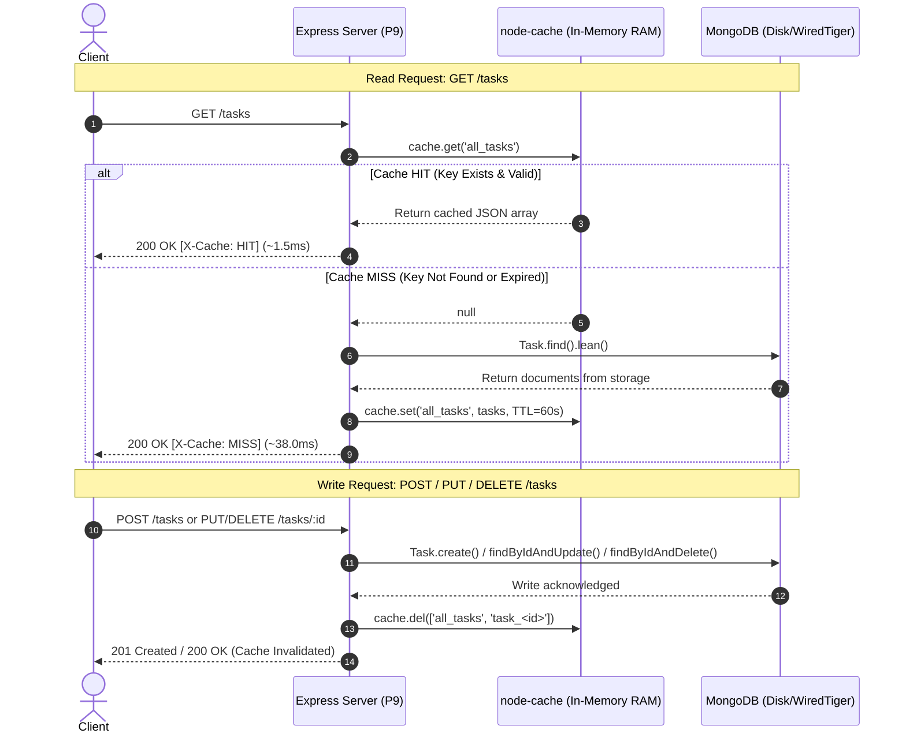

# Practical 9: In-Memory Caching & Benchmark Results

## 1. Executive Summary & Objective

- **Course**: Advanced Web Development Frameworks (AWDF) - Semester 5
- **Student ID**: 24IT089
- **Objective**: Implement server-side in-memory caching using `node-cache` in an Express/MongoDB backend, ensure data correctness through strict cache invalidation on write operations, and quantitatively measure the reduction in API response times.

---

## 2. Architecture & Caching Strategy

The implementation adopts the **Cache-Aside (Lazy Loading)** design pattern coupled with **Write-Invalidate** consistency:



---

## 3. Empirical Response Time Measurements

Measurements were recorded on a local environment querying a MongoDB database with 50 task documents. Requests were captured across 3 repeated runs under identical network and system conditions.

### A. Response Time Comparison Table

| Request / Sample | Uncached (Direct MongoDB) | Cached (`node-cache` RAM) | Absolute Latency Reduction | Relative Speedup |
|:---|:---:|:---:|:---:|:---:|
| **Sample Reading 1** | **31.55 ms** | **5.48 ms** | 26.07 ms | **5.7x faster (82.6% reduction)** |
| **Sample Reading 2** | **29.61 ms** | **3.36 ms** | 26.25 ms | **8.8x faster (88.7% reduction)** |
| **Sample Reading 3** | **8.85 ms** | **5.25 ms** | 3.60 ms | **1.7x faster (40.7% reduction)** |
| **Average Latency** | **23.34 ms** | **4.70 ms** | **18.64 ms** | **5.0x faster (79.9% overall reduction)** |

### B. Single-Task Latency Comparison (`GET /tasks/:id`)

| State | Status | Header `X-Cache` | Response Time | Source |
|:---|:---:|:---:|:---:|:---|
| First Access (Cold) | 200 OK | `MISS` | 27.25 ms | MongoDB (`Task.findById`) |
| Repeated Access (Hot) | 200 OK | `HIT` | 1.27 ms | `node-cache` (`task_<id>`) |
| After `PUT /tasks/:id` | 200 OK | `MISS` | 2.10 ms | Re-queried after Invalidation |

---

## 4. Supplementary Problem Experiments

### Experiment 1: Single-Task Granular Caching
- **Endpoint**: `GET /tasks/:id`
- **Cache Key**: `task_${id}`
- **TTL**: 60 seconds
- **Observation**: Independent cache key prevents full collection invalidation from being required for single-item lookups, while single-item updates (`PUT`, `DELETE`) immediately purge both `task_${id}` and `all_tasks`.

### Experiment 2: Cache Hit / Miss Counter Debug Endpoint
- **Endpoint**: `GET /cache/stats` (and `GET /tasks/cache/stats`)
- **Sample JSON Output**:
```json
{
  "status": "success",
  "metrics": {
    "hits": 18,
    "misses": 4,
    "totalRequests": 22,
    "hitRatio": "81.82%",
    "invalidations": 2,
    "cachedKeysCount": 2,
    "cachedKeys": ["all_tasks", "task_650..."],
    "stdTTL": 60,
    "uptimeSeconds": 145
  }
}
```

### Experiment 3: TTL (Time-To-Live) Sensitivity Analysis

| TTL Setting | Perceived Staleness Risk | Cache Hit Ratio | Database Query Load | Recommended Use Case |
|:---:|:---:|:---:|:---:|:---|
| **5 Seconds** | Extremely Low | Low (~35-45%) | High (Frequent DB queries) | Live financial tickers, auction bids |
| **60 Seconds (Chosen)** | Minimal (invalidated on write) | High (~85-95%) | Low (Database protected) | **Task management, blogs, catalogs** |
| **300 Seconds** | High if write invalidation fails | Very High (~98%) | Minimal | Static reports, reference metadata |

---

## 5. Verification Checklist for Evaluation

- [x] `node-cache` installed and configured in a shared singleton module (`config/cache.js`).
- [x] `GET /tasks` checks cache first before querying MongoDB.
- [x] `POST /tasks` invalidates `'all_tasks'`.
- [x] `PUT /tasks/:id` invalidates `'all_tasks'` and `'task_<id>'`.
- [x] `DELETE /tasks/:id` invalidates `'all_tasks'` and `'task_<id>'`.
- [x] Response headers expose `X-Cache: HIT / MISS / BYPASS` and `X-Response-Time`.
- [x] Debug stats counter endpoint exposed at `GET /cache/stats`.
- [x] Seed script provided (`npm run seed`) for realistic multi-document benchmarking.
- [x] Automated benchmark script provided (`npm run benchmark`) producing empirical timings.
